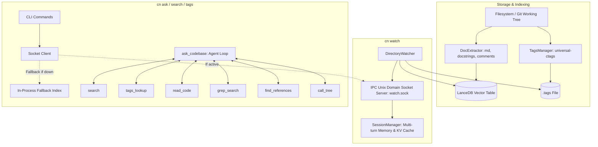
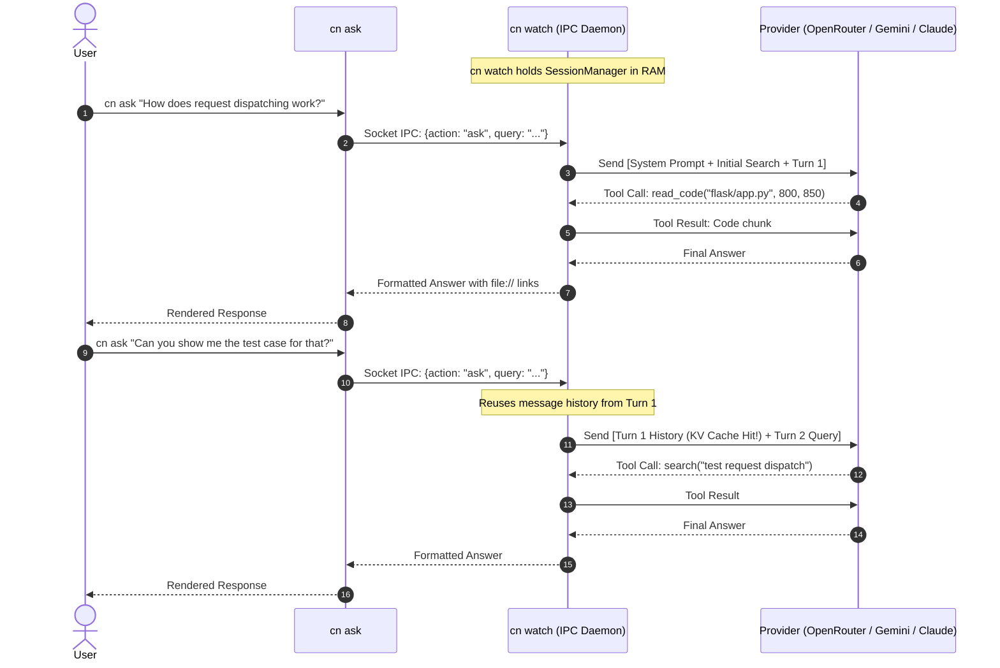

# Technical Design: codebase-navigator

## 1. Executive Summary & Vision

As described in [`README.md`](file:///home/nigel/code/codebase-navigator/README.md), modern AI coding assistants and developers face a fundamental dilemma:
1. **Context Bloat & Token Waste**: Ingesting entire codebases or hundreds of source files into LLM context windows burns millions of tokens, incurs massive latency, and often degrades reasoning fidelity ("lost in the middle").
2. **Brittle Brute-Force Grepping**: Forcing an LLM to blindly guess regex patterns via `ripgrep` wastes 3–6 agent turns just trying to locate basic definitions or call sites.
3. **High Startup Friction**: Traditional code intelligence tools require heavy external services (e.g. Docker, dedicated vector databases, or Ollama daemons).

`codebase-navigator` (`cn`) solves this by providing an **ultra-lightweight, self-contained code intelligence engine and agent harness**. It combines:
- **Instant Vector Retrieval** via LanceDB and embedded `sentence-transformers` without external service daemons.
- **Deterministic Symbol Navigation** via Git-aware `universal-ctags`.
- **Live Incremental Indexing & Daemon Socket** via `cn watch`.
- **Multi-turn Session Memory & Provider KV-Cache Continuity** across CLI invocations.
- **Autonomous Agent Harness (`cn ask`)** equipped with 1-shot hybrid code intelligence tools (`search`, `tags_lookup`, `read_code`, `grep_search`, `find_references`, `call_tree`).

```
                              ┌────────────────────────────────────────────────────────┐
                              │                    codebase-navigator                  │
                              │                                                        │
                              │   ┌─────────────┐   ┌──────────────┐   ┌───────────┐   │
                              │   │ LanceDB RAG │ + │ ctags (.tags)│ + │ AST/Tools │   │
                              │   └─────────────┘   └──────────────┘   └───────────┘   │
                              └───────────────────────────┬────────────────────────────┘
                                                          │
                                         ┌────────────────┴────────────────┐
                                         ▼                                 ▼
                             ┌───────────────────────┐         ┌───────────────────────┐
                             │ Human Dev Orientation │         │ Autonomous AI Agents  │
                             │ (Fast CLI Q&A & Tags) │         │ (40-80% Token Savings)│
                             └───────────────────────┘         └───────────────────────┘
```

---

## 2. System Architecture

The project is structured into modular layers spanning indexing, background daemon services, tool execution, and the LLM agent harness:



---

## 3. Core Subsystems

### 3.1. Vector & Semantic Search (`index.py`, `extractor.py`)
- **Model**: `sentence-transformers/all-MiniLM-L6-v2` runs locally in-process via PyTorch/Transformers.
- **Storage**: Serverless LanceDB vector database persisted under `.codebase-navigator/`.
- **Hybrid Boosting**:
  - Semantic vector similarity combined with exact term boosting on chunk headers and symbol names.
  - Granular chunking: Markdown section headers, term definitions, Python class/function docstrings, and generic multi-line comment blocks.

### 3.2. Git-Aware Symbol Indexing (`tags.py`)
- Uses `universal-ctags` with `-L - --fields=+n+K --sort=yes`.
- Restricts indexing to files recognized by `git ls-files` (or source extensions) to exclude `node_modules`, build artifacts, and vendor dumps.

### 3.3. Live Watcher & Daemon Session IPC (`watcher.py`, `ipc.py`)
- **`watchfiles` Engine**: Detects code and documentation modifications with a 1000ms debounce.
- **IPC Unix Domain Socket**: Listens on `.codebase-navigator/watch.sock`.
- **Hot In-Memory State**: Keeps the LanceDB table and embedding model pre-loaded in memory, delivering sub-10ms semantic searches to CLI clients.
- **Persistent Conversation Session**:
  - `cn watch` maintains the agent conversation message history across repeated `cn ask` commands.
  - Subsequent queries append to the existing conversation tree, enabling provider-side **KV prompt caching** and zero-overhead follow-up questions.

### 3.4. Agent Intelligence Tools (`tools.py`)
To prevent the LLM from spending dozens of turns and thousands of tokens doing brute-force file navigation:

| Tool | Implementation | Purpose & Token Optimization |
|---|---|---|
| `search` | LanceDB hybrid query | Semantic retrieval of relevant concepts, docstrings, and modules. |
| `tags_lookup` | Regex match on `.tags` | 1-step direct resolution of symbol definitions without fuzzy guessing. |
| `read_code` | Line-bounded file reader | Safe viewing of function/file bodies (capped at max 500 lines) with clickable file URI links. |
| `grep_search` | Subprocess `rg --json` with pure Python fallback | Fast pattern and literal matching across codebase. Emits loud warning when `rg` is missing. |
| `find_references` | Hybrid ctags + ripgrep | 1-shot tool returning symbol definition + all caller and usage sites across the repo. |
| `call_tree` | Python AST + Regex reference tracer | Traces incoming callers and outgoing callees for functions and classes in a single turn. |

### 3.5. Agent Harness & Execution Loop (`ask.py`)
- **Pre-flight Seed Retrieval**: On initial query, automatically conducts a top-10 hybrid semantic search and attaches the results to the first user turn.
- **System Prompt Guardrails**:
  - Rejects off-topic conversational queries; strictly answers repository implementation details.
  - Requires verification of code definitions via `read_code` or `view_symbol` before asserting implementation details.
  - Explicit instruction to conserve tokens and avoid redundant tool calls.
- **Configurable Tool Budget**: Defaults to generous turn limits, with automatic fallback when the model produces the final synthesis.

---

## 4. Multi-Turn Session & KV Cache Flow

When `cn watch` is active, the conversational flow between successive `cn ask` invocations is preserved:



---

## 5. Evaluation & Benchmarking Strategy

To ensure high-quality, hallucination-free retrieval across multiple languages, evaluation test suites are run against standard open-source repositories in `~/code/codebase-navigator-exercises/`:

1. **`tiangolo/fastapi`** (Python): Dependency injection resolution and route parameter parsing.
2. **`pallets/flask`** (Python): Request lifecycle, `before_request` hooks, and WSGI dispatch.
3. **`encode/httpx`** (Python): Sync vs async transport routing and connection pooling.
4. **`astral-sh/uv`** (Rust): CLI dependency resolution entry points and workspace crate graphs.
5. **`go-vikunja/vikunja`** (Go + Frontend): Background queue workers, reminder scheduling, and API routing.
6. **`expressjs/express`** (Node.js/JS): Middleware stack compilation and router layer matching.

### Metric Criteria:
- **Retrieval Precision**: Does the agent cite the exact file and line numbers of the true implementation?
- **Turn Efficiency**: Does the agent reach the correct conclusion within 1–3 tool turns?
- **Token Economy**: Does the hybrid toolset reduce total prompt/completion tokens compared to raw file grep sweeps?
