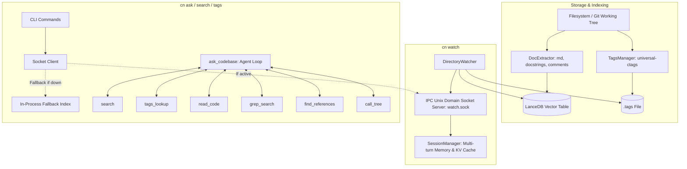
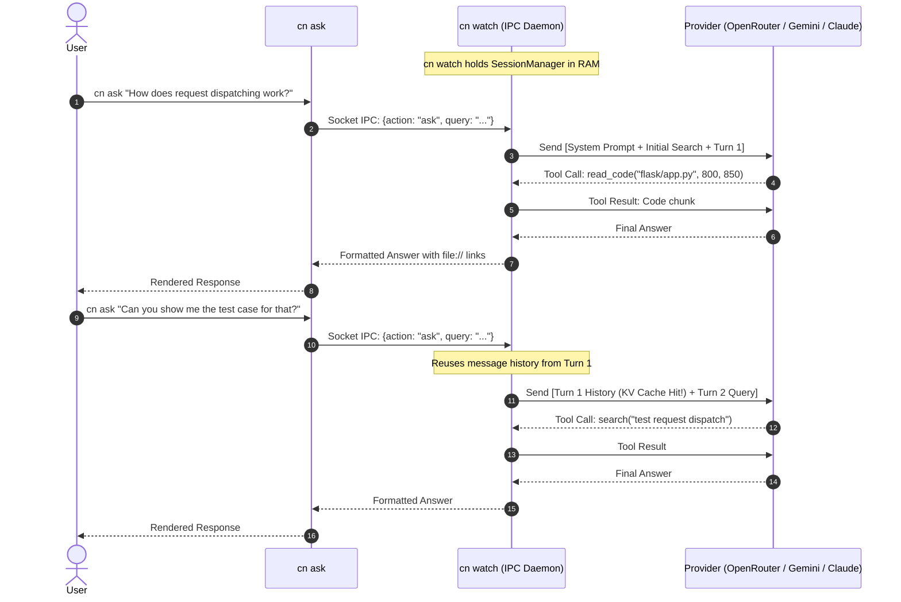

# Technical Design: codebase-navigator

## 1. Executive Summary & Vision

As described in [`README.md`](file:///home/nigel/code/codebase-navigator/README.md), modern AI coding assistants and developers face a fundamental dilemma:
1. **Context Bloat & Token Waste**: Ingesting entire codebases or hundreds of source files into LLM context windows burns millions of tokens, incurs massive latency, and often degrades reasoning fidelity ("lost in the middle").
2. **Brittle Brute-Force Grepping**: Forcing an LLM to blindly guess regex patterns via `ripgrep` wastes 3–6 agent turns just trying to locate basic definitions or call sites.
3. **High Startup Friction**: Traditional code intelligence tools require heavy external services (e.g. Docker, dedicated vector databases, or Ollama daemons).

`codebase-navigator` (`cn`) solves this by providing an **ultra-lightweight, self-contained code intelligence engine and agent harness**. It combines:
- **Instant Vector Retrieval** via LanceDB and embedded `sentence-transformers` without external service daemons.
- **Deterministic Symbol Navigation** via Git-aware `universal-ctags`.
- **Live Incremental Indexing & Daemon Socket** via `cn watch`.
- **Multi-turn Session Memory & Provider KV-Cache Continuity** across CLI invocations.
- **Autonomous Agent Harness (`cn ask`)** equipped with 1-shot hybrid code intelligence tools (`search`, `tags_lookup`, `read_code`, `grep_search`, `find_references`), fronted by a deterministic question router that skips semantic retrieval for plain symbol lookups.

```
                              ┌────────────────────────────────────────────────────────┐
                              │                    codebase-navigator                  │
                              │                                                        │
                              │   ┌─────────────┐   ┌──────────────┐   ┌───────────┐   │
                              │   │ LanceDB RAG │ + │ ctags (.tags)│ + │ AST/Tools │   │
                              │   └─────────────┘   └──────────────┘   └───────────┘   │
                              └───────────────────────────┬────────────────────────────┘
                                                          │
                                         ┌────────────────┴────────────────┐
                                         ▼                                 ▼
                             ┌───────────────────────┐         ┌───────────────────────┐
                             │ Human Dev Orientation │         │ Autonomous AI Agents  │
                             │ (Fast CLI Q&A & Tags) │         │ (40-80% Token Savings)│
                             └───────────────────────┘         └───────────────────────┘
```

---

## 2. System Architecture

The project is structured into modular layers spanning indexing, background daemon services, tool execution, and the LLM agent harness:



---

## 3. Core Subsystems

### 3.1. Vector & Semantic Search (`index.py`, `extractor.py`)
- **Model**: `sentence-transformers/all-MiniLM-L6-v2` runs locally in-process via PyTorch/Transformers.
- **Storage**: Serverless LanceDB vector database persisted under `.codebase-navigator/`.
- **Encoder window**: fastembed's build of this model truncates at **128 tokens**,
  not the 256/512 the model card implies. 73% of indexed chunks exceed that and
  61% of indexed content never reaches the encoder. Counter-intuitively this is
  fine: splitting chunks to fit measured *worse* retrieval (MRR 0.717 -> 0.561),
  because a code chunk's head -- signature plus docstring -- carries the
  identifying signal while body fragments are low-signal near-duplicates that
  crowd distinct files out of the top-k. `split_oversize_chunks()` exists and is
  tested behind `CN_SPLIT_OVERSIZE_CHUNKS`; turn it on only when moving to a
  long-context code embedding model, where truncation no longer hides the tail.
- **Ranking** (`VectorIndex.search`):
  - **Reciprocal Rank Fusion** over the vector and BM25/FTS result lists (k=20,
    FTS weighted 1.2). RRF is rank-based and scale-free, so it is used directly
    rather than compared against raw cosine proximity -- an earlier
    `max(cosine, rrf)` formulation meant the vector term always won and the BM25
    half of the "hybrid" search was silently discarded.
  - Identifier-aware boosts proportional to the share of query terms matched in
    the chunk title, path, and body. Scores are deliberately unclamped: an
    earlier `min(0.99, ...)` ceiling tied distinct candidates together and made
    the score useless as a confidence signal.
  - **Code-first ordering**: documentation is demoted below code, but never
    dropped, and the demotion is skipped for doc-seeking queries
    (`is_doc_seeking`). Doc-heavy repositories otherwise drown code -- FastAPI
    indexes 15,839 markdown chunks against 5,689 code chunks, and 8.6 of every
    10 unfiltered hits were prose.
  - **Per-file diversity cap** (`MAX_CHUNKS_PER_FILE`): several chunks of one
    file crowded out other candidates, giving only 4.8 distinct files per 10
    hits; capping raises that to 9.7.
  - Granular chunking: Markdown section headers, term definitions, Python class/function docstrings, and generic multi-line comment blocks.
- **Concurrent Search Safety**: In-process indexes share one lazily initialized
  FastEmbed/ONNX model. Query embedding is serialized to avoid competing ONNX
  session initialization and inference stalls, while LanceDB reads remain
  parallel.

### 3.2. Git-Aware Symbol Indexing (`tags.py`)
- Uses `universal-ctags` with `-L - --fields=+n+K --sort=yes`.
- Restricts indexing to files recognized by `git ls-files` (or source extensions) to exclude `node_modules`, build artifacts, and vendor dumps.

### 3.3. Live Watcher & Daemon Session IPC (`watcher.py`, `ipc.py`)
- **`watchfiles` Engine**: Detects code and documentation modifications with a 1000ms debounce.
- **Dual Transport IPC**:
  - **Unix Domain Socket**: Listens on `.codebase-navigator/watch.sock` for high-speed local IPC.
  - **Loopback TCP Transport**: Binds on `127.0.0.1:<port>` with port metadata written to `.codebase-navigator/watch.port`. The default port is deterministically hashed from the directory path into the range `10000..59999` with automatic collision fallback. This allows sandboxed runtimes (like Codex sandboxes or Docker containers with volume socket restrictions) to seamlessly connect.
- **Hot In-Memory State**: Keeps the LanceDB table and embedding model pre-loaded in memory, delivering sub-10ms semantic searches to CLI clients.
- **Persistent Conversation Session**:
  - `cn watch` maintains the agent conversation message history across repeated `cn ask` commands.
  - Subsequent queries append to the existing conversation tree, enabling provider-side **KV prompt caching** and zero-overhead follow-up questions.

### 3.4. Agent Intelligence Tools (`tools.py`)
To prevent the LLM from spending dozens of turns and thousands of tokens doing brute-force file navigation:

| Tool | Implementation | Purpose & Token Optimization |
|---|---|---|
| `search` | LanceDB hybrid query (RRF over vector + BM25) | Semantic retrieval of relevant concepts, docstrings, and modules. |
| `tags_lookup` | Regex match on `.tags` | 1-step direct resolution of symbol definitions without fuzzy guessing. |
| `read_code` | Line-bounded file reader | Safe viewing of function/file bodies with clickable file URI links. Accepts a `ranges` array so several spans (or several files) are fetched in one turn. |
| `grep_search` | Subprocess `rg --json` with pure Python fallback | Fast pattern and literal matching across codebase. Emits loud warning when `rg` is missing. |
| `find_references` | Hybrid ctags + ripgrep | 1-shot tool returning symbol definition + all caller and usage sites across the repo. |

`call_tree` remains implemented in `tools.py` but is no longer advertised in the
default tool spec: it was called zero times across 25 benchmark tasks while
costing spec tokens on every turn, and `find_references` covers the same need.

Every grep-style result is byte-capped per match (`MAX_MATCH_CHARS`). A single
generated line in a real repository can be ~486k characters; uncapped, one such
match cost ~179k tokens in a single tool result and was then re-sent on every
subsequent turn.

### 3.5. Agent Harness & Execution Loop (`ask.py`)
- **Question Routing**: `classify_question()` decides, deterministically and
  without an LLM call, whether a question warrants pre-flight retrieval.
  Identifier lookups ("where is `FlaskGroup` defined?") go straight to
  `grep_search`/`tags_lookup`; conceptual questions ("how does the dispatch flow
  work?") get the seed. The seed costs ~1,700 tokens and, because it lives in
  the message history, is re-sent on every subsequent turn -- roughly 13.6k
  cumulative over a typical 8-turn session -- while only ~2.8 of its 10 chunks
  came from a file the agent went on to open. A misroute is cheap: the agent
  still has `search` and recovers in one tool call. Override with
  `seed_mode`/`CN_SEED_MODE` (`always` | `router` | `never`).
- **Pre-flight Seed Retrieval**: For conceptual questions, conducts a top-10
  hybrid semantic search and attaches the results to the first user turn.
- **System Prompt Guardrails**:
  - Rejects off-topic conversational queries; strictly answers repository implementation details.
  - Requires verification of code definitions via `read_code` or `view_symbol` before asserting implementation details.
  - Explicit instruction to conserve tokens and avoid redundant tool calls.
- **Configurable Tool Budget**: Defaults to generous turn limits, with automatic fallback when the model produces the final synthesis.

---

## 4. Multi-Turn Session & KV Cache Flow

When `cn watch` is active, the conversational flow between successive `cn ask` invocations is preserved:



---

## 5. Evaluation & Benchmarking Strategy

To ensure high-quality, hallucination-free retrieval across multiple languages, evaluation test suites are run against standard open-source repositories in `eval/repos/`:

1. **`tiangolo/fastapi`** (Python): Dependency injection resolution and route parameter parsing.
2. **`pallets/flask`** (Python): Request lifecycle, `before_request` hooks, and WSGI dispatch.
3. **`encode/httpx`** (Python): Sync vs async transport routing and connection pooling.
4. **`astral-sh/uv`** (Rust): CLI dependency resolution entry points and workspace crate graphs.
5. **`go-vikunja/vikunja`** (Go + Frontend): Background queue workers, reminder scheduling, and API routing.
6. **`expressjs/express`** (Node.js/JS): Middleware stack compilation and router layer matching.

The suite mixes two question shapes, because they exercise opposite paths:
25 **conceptual** questions ("how does X work") that justify semantic retrieval,
and 7 **lookup** questions ("where is `FlaskGroup` defined?") that a single
ripgrep answers and where pre-flight retrieval is pure overhead. Without the
lookup half the question router cannot be measured at all -- every conceptual
question routes the same way with or without it.

### Metric Criteria:
- **Retrieval Precision**: Does the agent cite the exact file and line numbers of the true implementation?
- **Turn Efficiency**: Does the agent reach the correct conclusion within 1–3 tool turns?
- **Token Economy**: Does the hybrid toolset reduce total prompt/completion tokens compared to raw file grep sweeps?

### Fairness constraints

A/B token comparisons are only meaningful when both arms are bounded the same
way. Both `cn` and the baseline harness byte-cap individual grep matches; before
that cap existed the baseline capped by line count only, so one 486k-character
generated line in vikunja produced a ~179k-token tool result. That single task
supplied *all* of a reported "+15.8% token saving" -- with it excluded the same
run showed cn 17.5% **worse** than the baseline. Prefer the median per-task
outcome and the win/loss split over a summed aggregate, which one pathological
task can dominate.

Note also that a 25/25-vs-25/25 pass rate means the suite has no accuracy
headroom left and is measuring cost only.

Repositories are cloned only when missing; existing checkouts are never updated
by the evaluator. LanceDB and ctags indexes are built atomically and cached at
`eval/repos/_indexes/<repository>/<codebase-navigator-short-hash>/`. A sidecar
manifest pins the full codebase-navigator and target-repository commits,
embedding model, indexed counts, and a SHA-256 over the complete immutable index
tree. Cache hits recompute and validate that hash before reuse.

Each benchmark invocation produces an auditable package under
`eval/runs/run_<UTC timestamp>/` containing `report.json`, `log.jsonl`, the exact
benchmark task snapshot, and per-repository index metadata snapshots. Both the
initial index hash and post-run verification hash are logged. Repository Git
commits, embedding model, candidate model, judge model, and cumulative per-call
token usage are recorded. Parallel TTY progress reserves one independently
updated line per worker, leading with elapsed time and then the current
local-search phase. Rows are capped at 80 terminal columns to prevent wrapping,
while each completed task's question and result lines are buffered and inserted
atomically above the live region. Phase changes are appended immediately to
`log.jsonl` so incomplete tasks remain diagnosable;
interruption cancels queued futures, records partial-run status, and the
CLI terminates without waiting on blocked network threads. The judge defaults
to `deepseek/deepseek-v4-pro` and is independently configurable from the
candidate model.
