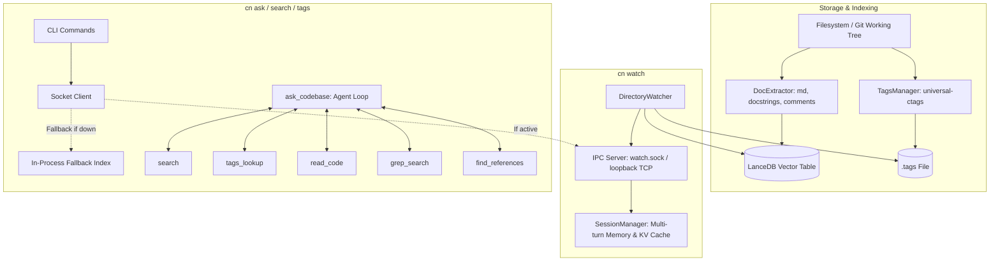
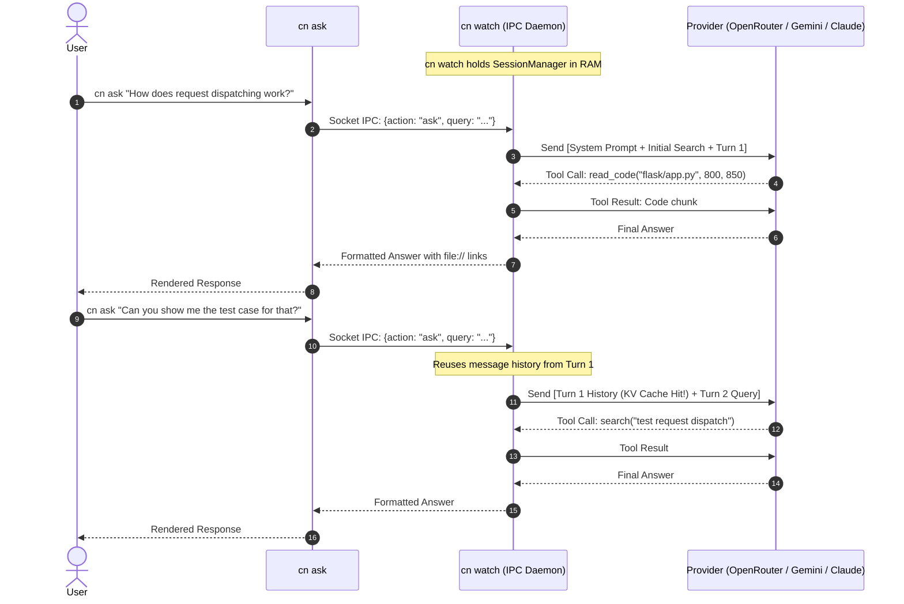

# Technical Design: codebase-navigator

## 1. Vision & Purpose

When developers or AI coding agents explore an unfamiliar codebase, they run into three persistent bottlenecks:

1. **Context Bloat**: Stuffing dozens of source files into an LLM's context window burns thousands of tokens, increases latency, and degrades reasoning ("lost in the middle").
2. **Blind Grepping**: Asking an agent to locate code with raw `ripgrep` commands wastes 3 to 6 conversation turns just wandering around searching for definitions or call sites.
3. **Heavy Setup**: Traditional code intelligence tools require heavy infrastructure—like Docker containers, dedicated vector database servers, or complex Language Server Protocol (LSP) daemons.

`codebase-navigator` (`cn`) is a **lightweight, self-contained code intelligence engine and agent harness**. It combines:
- **Instant Hybrid Retrieval**: Embedded vector search via LanceDB and FastEmbed alongside BM25 full-text search, with zero external database servers.
- **Deterministic Symbol Navigation**: Git-aware `universal-ctags` for instant 1-step definition lookups.
- **Live Incremental Watcher**: A background daemon (`cn watch`) that keeps indexes fresh and models pre-warmed in memory.
- **Session Continuity & KV Caching**: In-memory session tracking that lets subsequent CLI invocations reuse prompt history and benefit from provider-side KV prompt caching.
- **Purpose-Built Agent Harness (`cn ask`)**: An autonomous agent equipped with navigation tools (`search`, `tags_lookup`, `read_code`, `grep_search`) and a fast heuristic router that skips semantic retrieval when looking up raw symbols.

```
    ┌────────────────────────────────────────────────────────┐
    │                    codebase-navigator                  │
    │                                                        │
    │   ┌─────────────┐   ┌──────────────┐   ┌───────────┐   │
    │   │ LanceDB RAG │ + │ ctags (.tags)│ + │ AST/Tools │   │
    │   └─────────────┘   └──────────────┘   └───────────┘   │
    └───────────────────────────┬────────────────────────────┘
                                │
               ┌────────────────┴────────────────┐
               ▼                                 ▼
   ┌───────────────────────┐         ┌───────────────────────┐
   │ Human Dev Orientation │         │ Autonomous AI Agents  │
   │ (Fast CLI Q&A & Tags) │         │ (40-80% Token Savings)│
   └───────────────────────┘         └───────────────────────┘
```

---

## 2. High-Level Architecture

The system is organized into three main layers: indexing & storage, a background daemon, and the CLI/agent harness.



1. **Storage & Indexing**: Scans repository files to extract comments, docstrings, and markdown chunks into an embedded LanceDB database, while running `universal-ctags` to generate a fast `.tags` symbol file.
2. **Background Daemon (`cn watch`)**: Watches the filesystem for changes, debounces edits, incrementally updates LanceDB and `.tags`, and hosts an IPC server with pre-warmed models and multi-turn session state.
3. **CLI & Agent Harness (`cn ask`)**: Connects to the daemon over IPC (or runs in-process if the daemon isn't running) to answer questions using targeted tools.

---

## 3. Core Subsystems

### 3.1. Vector & Semantic Search (`index.py`, `extractor.py`)

- **Embedding Model**: Uses `jinaai/jina-embeddings-v2-base-code` (8,192-token context window, trained specifically on code), running locally in-process via FastEmbed / ONNX Runtime.
- **Storage**: Serverless LanceDB database stored in the local `.codebase-navigator/` directory. No background database service is required.
- **Hybrid Search & Ranking**:
  - **Reciprocal Rank Fusion (RRF)**: Runs vector search (cosine similarity) and BM25 full-text search separately, then combines their ranks directly ($k=20$, BM25 weighted 1.2). An earlier formula that took $\max(\text{cosine}, \text{rrf})$ was discarded because cosine scores routinely overshadowed RRF scores, which inadvertently disabled the keyword half of hybrid search.
  - **Identifier Overlap Boosts**: Awards bonuses based on the proportion of query terms matched in chunk titles, file paths, and chunk bodies. Scores are left unclamped to preserve relative ranking confidence.
  - **Code-First Ordering**: Code chunks are prioritized over markdown documentation by default, unless the query explicitly asks for documentation (e.g., questions containing "docs", "readme", "install"). This prevents repositories with huge documentation trees (like FastAPI, where markdown chunks outnumber code 3 to 1) from burying the actual implementation.
  - **Per-File Diversity Cap**: Limits initial candidate chunks to 1 chunk per file (`MAX_CHUNKS_PER_FILE = 1`). This prevents a single large file from monopolizing all top-10 slots.
- **Concurrency Safety**: Query embedding is serialized to avoid ONNX session contention, while LanceDB read queries execute concurrently.

### 3.2. Git-Aware Symbol Indexing (`tags.py`)

- Runs `universal-ctags` with line numbers and kind tags (`--fields=+n+K --sort=yes`).
- Restricts indexing to files tracked by Git (`git ls-files`) or standard source extensions. This automatically ignores `node_modules/`, virtual environments, vendor directories, and build artifacts.

### 3.3. Live Watcher & IPC Daemon (`watcher.py`, `ipc.py`)

- **Filesystem Watcher**: Uses `watchfiles` to monitor repository changes with a 1,000ms debounce.
- **Dual Transport IPC**:
  - **Unix Domain Socket**: Listens on `.codebase-navigator/watch.sock` for low-latency local communication.
  - **Loopback TCP Transport**: Binds to `127.0.0.1:<port>` with port metadata written to `.codebase-navigator/watch.port`. The port is deterministically derived from a hash of the project directory path (within `10000..59999`) with automatic collision resolution. This allows containerized or sandboxed runtimes (like Docker or Codex sandboxes) to connect even when Unix socket sharing across volume mounts is restricted.
- **Pre-warmed Memory**: Keeps the LanceDB table and embedding model loaded in RAM, allowing CLI searches to return in under 10ms.
- **Conversation State**: Keeps multi-turn message history in memory, enabling follow-up questions to reuse provider KV prompt caches without re-sending the initial search context.

### 3.4. Agent Intelligence Tools (`tools.py`)

Rather than giving the LLM generic bash or grep access, `codebase-navigator` provides five specialized tools designed to minimize turns and token usage:

| Tool | Implementation | Purpose & Token Optimization |
|---|---|---|
| `search` | Hybrid LanceDB search (RRF over vector + BM25) | Semantic retrieval for concepts, modules, and docstrings. |
| `tags_lookup` | Regex match on `.tags` | Instant 1-step symbol definition lookup without guessing files. |
| `read_code` | Line-bounded file reader | Reads specific spans of code. Supports a `ranges` array so multiple spans or files can be read in a single turn. |
| `grep_search` | Subprocess `rg --json` with pure Python fallback | Fast exact string and pattern matching. Output is byte-capped per match, and an empty scoped search reports whether the pattern exists outside the glob. |

`find_references` remains implemented but, like `call_tree`, is no longer advertised in the default tool spec: it was called once across 32 benchmark tasks while costing 64 tokens on each of 199 turns — roughly 12,700 tokens for a single invocation. `grep_search` covers the need.

**Measured and rejected: snapping reads to definition boundaries.** A range-based read of a function body is inherently sequential — the agent cannot know it needs lines 570-595 until it has read 500-570 — and on `express-view-rendering` it read `lib/application.js` at 500-570, then 570-595, then 615-645, with the first two both inside `app.render` (522-597). Widening each request to its enclosing definition (via ctags line numbers in `.tags`, so language-aware with no parser and no extra tool) does fix that case exactly: 500-570 returns 494-597 and the follow-up disappears.

Replayed across every read in a full run it loses. The saving needs a *later* read of the same file to land inside the widened range, which happened 4 times in 126 reads, while the cost is paid on all of them:

| widen cap (lines) | reads widened | extra lines | later reads covered | net tokens |
|---|---|---|---|---|
| 10 | 20 | 149 | 0 | −1,788 |
| 40 | 65 | 1,278 | 2 | −1,336 |
| 80 | 90 | 2,733 | 4 | −4,796 |
| 200 | 103 | 4,371 | 4 | −24,452 |

Negative at every cap, and start-only snapping is worse still (no reads saved). The general error was generalising from one vivid trace without checking how often the pattern occurs: an 87% cost rate against a 3% hit rate.

**A grep miss must say whose fault it is.** A glob like `src/flask/*.py` does not recurse, so searching it for `register_blueprint` returned "No pattern matches found" while 25 matches sat in `src/flask/sansio/`. On `flask-cli-click` the agent read that as *not here*, tried four more globs, then fell back to raw `bash grep` six times — twelve of its sixteen turns spent recovering from a message that was true and useless. An empty scoped search now retries unscoped and reports the count, the files, and the recursion caveat. The general lesson: a tool result the agent cannot act on correctly costs turns, and turns are the whole budget.

**Tool Refinements**:
- **Why `call_tree` was removed from the active spec**: It was called zero times across 25 benchmark tasks, yet its schema consumed tokens on every turn. `find_references` solved the same need in fewer steps.
- **Byte Caps on Grep Matches (`MAX_MATCH_CHARS = 240`)**: A single generated or minified line in a repository (e.g. 486,000 characters) can explode into ~179,000 tokens in a single tool response. Capping line length per match prevents context blowouts.

### 3.5. Agent Execution Loop (`ask.py`)

- **Deterministic Question Router**: Before invoking any LLM, `classify_question()` checks whether the query is a simple symbol lookup ("where is `FlaskGroup` defined?") or a conceptual question ("how does request dispatching work?").
  - Identifier lookups skip pre-flight semantic retrieval and jump straight to `tags_lookup`/`grep_search`.
  - Conceptual questions retrieve a top-10 hybrid search "seed" in the initial prompt.
  - This heuristic runs in under a millisecond and avoids spending a round-trip LLM call just to decide how to search.
- **System Prompt Guardrails**:
  - Directs the model to focus strictly on code implementation details.
  - Requires the agent to inspect real code definitions (via `read_code`) before claiming how something works.
  - Explicitly instructs the agent to minimize redundant tool invocations.
- **Turn Budgeting**: Tracks remaining turns and issues a warning at 3 turns remaining so the model wraps up with a synthesis rather than hitting an abrupt cutoff.

---

## 4. Multi-Turn Conversations & KV Cache Flow

When `cn watch` is running, subsequent `cn ask` commands share conversation history via the daemon's in-memory session manager:



Because the message history is appended rather than re-created, modern LLM providers (which cache prompt prefixes) serve Turn 2 prompt tokens directly from their KV cache. This makes follow-up questions both substantially faster and cheaper.

---

## 5. Evaluation & Benchmarking Strategy

To ensure code intelligence remains accurate and cost-effective across languages, an automated benchmark suite (`eval/`) tests `codebase-navigator` against real open-source repositories:

1. **`tiangolo/fastapi`** (Python): Dependency injection and route parameter parsing.
2. **`pallets/flask`** (Python): Request lifecycle, `before_request` hooks, and WSGI dispatch.
3. **`encode/httpx`** (Python): Sync vs. async transport routing and connection pooling.
4. **`astral-sh/uv`** (Rust): CLI dependency resolution entry points and workspace crate graphs.
5. **`go-vikunja/vikunja`** (Go + Frontend): Background queue workers, reminder scheduling, and API routing.
6. **`expressjs/express`** (Node.js/JS): Middleware stack compilation and router layer matching.

The benchmark questions are divided into two distinct categories:
- **25 Conceptual Questions** ("how does X work"): These require locating relevant architecture and tracing logic, testing hybrid semantic search.
- **7 Lookup Questions** ("where is `FlaskGroup` defined?"): These can be answered with a direct symbol or grep lookup, testing whether the question router correctly avoids unnecessary semantic search overhead.

### Evaluation Fairness & Reproducibility
- **Comparable Tool Bounds**: Both `cn` and baseline comparison agents must enforce identical output limits (such as byte-capping grep matches). Otherwise, an uncapped baseline might pull in a 500k-character minified file, falsely inflating `cn`'s relative savings.
- **Pinned Repositories & Indexes**: Benchmark repos are checked out to specific commits. Indexes are cached under `eval/repos/_indexes/` with SHA-256 integrity verification over index files to prevent stale state from biasing results.
- **Auditable Benchmark Runs**: Each run outputs a timestamped artifact directory (`eval/runs/run_<timestamp>/`) containing full transcripts (`log.jsonl`), summary metrics (`report.json`), candidate model parameters, and judge evaluations.

---

## 6. Search Efficiency: Strategies and Tactics

The central goal of `codebase-navigator` is simple: **spend fewer tokens and less time answering questions, without sacrificing accuracy.**

Every tactic in this section was derived empirically by running benchmarks in `eval/` against baseline coding agents. When an optimization failed or degraded retrieval, that result was documented so it wouldn't be repeated.

### 6.0. What We Measure (and How to Read the Numbers)

When evaluating code navigation efficiency, we track three core dimensions:

1. **Token Count** (Cost)
2. **Time / Latency** (Speed)
3. **Accuracy** (Quality)

#### The Nuances of Token Count

"Tokens" is not a monolithic number. In multi-turn agent interactions, token usage breaks down into distinct components:

- **Context Length (Per-Turn Prompt Size)**: The size of the prompt sent to the LLM on any single turn. This includes the system prompt, tool schemas, conversation history, and tool outputs. Keeping the initial turn and tool definitions small keeps per-turn context manageable.
- **Cumulative Tokens Across All Turns**: In agent loops, every turn re-transmits the entire conversation history up to that point. Because of this, total token spend scales **superlinearly** with the number of turns ($r \approx 0.88$ correlation between turn count and total tokens). An extra 1,500 tokens injected into the first turn doesn't just cost 1,500 tokens—in an 8-turn session, that information is sent 8 times, costing over 12,000 cumulative tokens! Saving a single turn saves far more tokens than trimming a few lines from a tool output.
- **Cached vs. Uncached Tokens (`net_tokens`)**: Providers with prompt caching (KV caching) charge significantly less for prompt tokens that match a previously processed prefix. If history is preserved unchanged, subsequent turns read primarily from cache (measured KV cache hit rate of ~65%). However, editing or evicting earlier messages breaks the cache prefix, forcing a full re-computation that often costs more than it saves.
- **Completion / Output Tokens**: The tokens generated by the model. These are typically much smaller in volume than prompt tokens, but carry higher per-token latency and cost.

#### The Nuances of Time (Wall-Clock Latency)

- **Round-Trip Dominance**: Wall-clock time is almost entirely dominated by LLM network latency and model generation speed, not local search execution. A local LanceDB search takes 10–30ms, while a single model round trip takes 2–5 seconds. Eliminating one agent turn saves seconds of human waiting time.

#### The Evaluation Instruments

1. **A/B Benchmark (`eval/runner.py --compare-baseline`)**: Runs the same task through `cn ask` and a baseline agent (equipped with standard tools: `read_file`, `grep`, `find_files`, `list_dir`, `bash`). Tracks `tokens`, `net_tokens` (uncached), `cached_tokens`, `api_calls` (turns), `duration_seconds`, and judge verdicts (`passed`).
2. **Offline Retrieval Scoring**: Evaluates ranking quality without making LLM calls. Measures **Recall@k** (is the answer file in the top 1, 3, 5, or 10 hits?), **MRR (Mean Reciprocal Rank)**, and **file diversity**.
3. **Prompt & Index Instrumentation**: Measures token sizes of chunk headers, tool definitions, seed payloads, and grep match byte caps.

#### How to Read the Numbers

Three principles emerged from our evaluation experiments:

- **Look at the median alongside the aggregate**: Aggregates can be deceiving. In one benchmark run, `cn` showed an aggregate token saving of **+14.7%**, but a per-task median of **−8.8%**. This revealed that `cn` saved massive amounts of tokens on complex questions, but had a slight overhead on trivial questions where the baseline guessed the file on turn 1. Reporting either number alone misses the full picture.
- **Watch out for single-task outliers**: In an early benchmark, a reported "+15.8% token saving" swung to **−17.5%** once a single outlier was removed. In that outlier task, the baseline agent matched a 486k-character generated line because its output wasn't byte-capped. That single error produced the entire apparent advantage. Both arms must be bounded identically before comparisons are valid.
- **Score infrastructure faults separately from wrong answers**: A dropped network socket or rate-limit error is an infrastructure glitch, not a failure of retrieval or reasoning. Lumping them together distorts accuracy metrics.

---

### 6.1. Stage 1: Question Routing (Before Any Model Call)

Before making any LLM call, `classify_question()` checks whether the user's prompt needs a pre-flight semantic search:

- **Identifier lookups** ("where is `create_venv` defined?"): Routed to `lookup`. No semantic search seed is created; the agent goes directly to `tags_lookup` or `grep_search`.
- **Conceptual questions** ("how does request dispatching work?"): Routed to `conceptual`. A top-10 hybrid search seed is attached to the initial prompt.

**Why a deterministic rule instead of an LLM call?**
Calling an LLM to classify the query would cost a full network round trip and hundreds of tokens—defeating the very purpose of routing. A fast, regex-based check runs in microseconds. If it misroutes, recovery is painless: the agent still has full access to `search` and `tags_lookup` as tools.

*Measured result*: On lookup questions, roughly 7 out of 10 seeded chunks came from files the agent never opened. Skipping the seed on lookup queries saved ~1,600 prompt tokens per turn.

---

### 6.2. Stage 2: Hybrid Retrieval

For conceptual questions, `VectorIndex.search()` executes a hybrid search with several optimizations:

- **Separate Vector & BM25 Candidate Pools**: Queries LanceDB for cosine similarity and full-text keyword matches independently, retrieving a wider pool (`fetch_limit = max(limit * 6, 40)`) before re-ranking.
- **Direct Reciprocal Rank Fusion (RRF)**: Combines vector and BM25 ranks using standard RRF ($k=20$, BM25 weight 1.2).
- **Identifier Overlap Boosts**: Adds score bonuses based on how many query terms appear in chunk titles, paths, and content.
- **Unclamped Scoring**: Eliminates artificial score ceilings (such as an earlier `min(0.99, ...)` rule), ensuring the model receives clear, differentiated confidence signals.
- **Per-File Diversity Cap**: Caps candidate chunks to 1 per file. This raised distinct files in top-10 hits from **4.8 to 9.7**.
- **Code-First Demotion**: Markdown chunks are automatically ranked below code chunks unless the query is explicitly searching for documentation.
- **Minified Bundles Excluded**: Compiled JavaScript is skipped at discovery, so it reaches neither the vector index nor `.tags`. `.js` is both what you write and what a bundler emits — a quirk unique to JavaScript, where extension cannot separate source from build output, so detection is by name marker (`.min.`, `.standalone.`, `.bundle.`) or a single line over 800 characters. Two vendored bundles in vikunja produced **60% of its entire 43,790-tag symbol index** (18,217 and 8,043 tags) because ctags reads minified code as thousands of one-character symbols; every English word then resolved to one of them, so `authentication` and `handled` anchored the agent on build output. The same files produced the 486,303-character grep line that cost 179k tokens in a single tool result.
- **Support-File Demotion**: Tests, examples, fixtures and benchmarks rank below implementation unless the query is asking about them. They exercise the code being asked about, so they match it semantically while never being the answer — measured at **44% of every top-10** (141 of 320 slots across the benchmark), and on `express-view-rendering` four of the top five hits were test files while the implementation sat at rank 10.

**Retrieval Progression on 25 Benchmark Tasks:**

| Configuration | Recall@1 | Recall@3 | Recall@10 | MRR |
|---|---|---|---|---|
| Baseline vector search | 10/25 | 15/25 | 20/25 | 0.505 |
| + Code-first ranking | 17/25 | 19/25 | 22/25 | 0.736 |
| + Reciprocal Rank Fusion | 18/25 | 20/25 | 21/25 | 0.757 |
| + Per-file diversity cap | 18/25 | 20/25 | **23/25** | **0.784** |

Re-measured on the current 32-task suite after the answer keys were corrected, demoting support files below implementation moves recall@3 from 25/32 to **30/32** and MRR from 0.720 to **0.760**:

| Configuration | Recall@1 | Recall@3 | Recall@5 | Recall@10 | MRR |
|---|---|---|---|---|---|
| Before support-file demotion | 20/32 | 25/32 | 28/32 | 30/32 | 0.720 |
| After support-file demotion | **21/32** | **30/32** | **30/32** | 30/32 | **0.760** |

---

### 6.3. Stage 3: Embedding Model Context Windows

An embedding model's real token window sets a hard limit on what the index can capture — but a bigger window turns out not to be worth paying for.

- Models routinely advertise larger contexts than their tokenizers actually enforce. `sentence-transformers/all-MiniLM-L6-v2` claims 256/512 and truncates at **128 tokens**; FastEmbed reports `max_length: None` for every model it ships. Always read the tokenizer's `truncation` config, never the model card.
- Under MiniLM, 73% of code chunks overflow, so **61% of indexed repository content never reaches the encoder**. That number is real. The obvious conclusion drawn from it was wrong.
- A tokenizer cloned to *measure* chunk length must have both truncation **and padding** disabled. With padding on, `encode()` returns exactly `max_length` for every input, and every length check silently passes.

**The measurement that settled it.** Three encoders, identical chunks, 26 benchmark tasks across Python, JavaScript, Go and Rust:

| Model | Window | Dim | Recall@1 | Recall@3 | Recall@10 | MRR | Chunks/sec |
|---|---|---|---|---|---|---|---|
| **all-MiniLM-L6-v2** | 128 | 384 | **20** | 23 | **26** | **0.842** | **82.9** |
| jina-embeddings-v2-base-code | 8,192 | 768 | 19 | 24 | 25 | 0.822 | 2.9 |
| jina-embeddings-v2-small-en | 8,192 | 512 | 17 | 20 | 25 | 0.741 | 8.9 |

The 128-token model wins recall@1, is the only one with perfect recall@10, and has the best MRR — at **29× the indexing throughput** of the code-trained long-context model. It is also the only one of the three that retrieves `express-view-rendering` at all. By language it ties or beats jina-code on Python, Go and Rust; jina-code's only edge is JavaScript (4/5 vs 3/5).

Against jina-code, 6 of 26 tasks differ — MiniLM better on 4, worse on 2, a two-tailed sign test giving **p = 0.69**. Indistinguishable on quality, decisive on cost. At a measured 47.6 chunks per 1k LOC, a 200,000-line repository indexes in **~1 minute** with MiniLM against **~27 minutes** with jina-code. `codebase-navigator` therefore ships MiniLM as the default; `CN_EMBEDDING_MODEL` remains available for anyone who wants to trade indexing time for the JavaScript difference.

**Why losing 61% of the content costs so little.** What survives a 128-token cut is the *head* of each chunk — the signature, decorators and docstring. That is where a symbol's identity lives. The body below it is largely boilerplate that resembles every other function in the repository. Truncation is not discarding 61% of the signal; it is discarding 61% of the noise.

**What was tried and rejected: splitting chunks to fit the window.** Splitting recovers 100% of the content and made retrieval *worse* — MRR fell from 0.717 to 0.561, and only reached 0.608 with the per-file diversity cap applied, while distinct files per 10 hits dropped from 4.3 to 3.5. Body fragments act as low-signal near-duplicates that crowd other files out of the top results. This experiment and the encoder comparison above are the same finding seen twice. `split_oversize_chunks()` is retained and tested behind `CN_SPLIT_OVERSIZE_CHUNKS` in case a future encoder changes the economics; on present evidence it should stay off.

**Batching matters more than the model.** The tokenizer pads to the longest sequence *in each batch*, so a single long chunk drags its whole batch up to its length. `_embed()` sorts inputs by length before batching and restores caller order afterwards: **1.68× faster** on real chunks, with vectors bit-identical to the unsorted path. MiniLM masked this problem entirely — truncating everything to 128 tokens made batches uniform by accident.

**Guardrails for changing models.** The vector width changes with the model, so `VectorIndex` raises `IndexModelMismatch` naming both dimensions rather than letting LanceDB surface an opaque "no vector column" error at query time. Dimensions resolve from FastEmbed's catalogue instead of a silent 384 default, which previously produced `Cannot cast to FixedSizeList(384): value at index 0 has length 512` from a stack frame that never mentions embeddings.

**The lesson worth keeping.** A measured *quantity* is not a measured *outcome*. "61% of content is discarded" was accurate, and the inference from it — that retrieval must therefore be suffering — was backwards. A 29× indexing regression shipped on the strength of that inference before anyone scored the alternative. Where an argument and an experiment are both available, the experiment decides; here the experiment cost nothing, since recall@k over the benchmark needs no LLM tokens at all.

---

### 6.4. Stage 4: Crafting the Initial Turn

The first user turn provides just enough context to orient the agent without overloading subsequent turns:

1. **Compact Directory Tree**: A 2-level directory tree (depth 2, $\le 50$ entries, ~170 tokens) gives the agent immediate spatial awareness of the repo layout, avoiding 2 to 4 initial `ls` or `find` calls.
2. **Exact Symbol Matches**: When the question mentions a recognized code identifier, exact definitions from `.tags` are included immediately.
3. **Tiered Pre-flight Seed**:
   - Up to 2 top chunks (`SEED_FULL_CHUNKS = 2`) are shown in full, with bodies capped at 16 lines.
   - Remaining candidate chunks are collapsed into 1-line summaries (file path, symbol name, and relevance score).
   - This reduced seed size by **38%** (from ~1,580 tokens to ~975 tokens) with no loss in retrieval accuracy.

---

### 6.5. Stage 5: The Agent Tool Loop

Every tool round trip re-transmits the accumulated conversation history. To keep the agent loop efficient:

- **Batched Reads (`read_code`)**: Allows the agent to request multiple line ranges or files in a single tool call. During testing, half of all read calls were follow-up reads of already-opened files; batching collapses these into single turns.
- **Lean Tool Definitions**: Fixed tool schemas are sent on every turn. By removing unused tools (such as `call_tree`), the tool definition payload was kept to 779 tokens.
- **Byte-Capped Match Output (`MAX_MATCH_CHARS = 240`)**: Limits the character length of individual grep matches to prevent generated code or bundled assets from flooding the context window.
- **Duplicate Call Suppression**: If the agent issues the exact same tool call with identical arguments twice, `cn` returns a cached result with a warning rather than re-executing.
- **Turn Budget Warnings**: At 3 turns remaining, the agent is warned to begin synthesizing its final answer, preventing runaway tool loops.
- **Resilient Retries**: Network timeouts and provider errors (408, 429, 5xx) are retried with exponential backoff, preventing transient API blips from failing an entire session.

---

### 6.6. Stage 6: Across Invocations

When running `cn watch`, the daemon keeps the session alive across multiple invocations of `cn ask`.

- **KV Prompt Cache Hits**: Follow-up questions append to the existing conversation tree, enabling provider-side KV prompt caching.
- **Zero Re-indexing Overhead**: File indexes are cached by commit hash and verified via SHA-256 digests. If the repository hasn't changed, queries execute immediately against the warm in-memory index.
