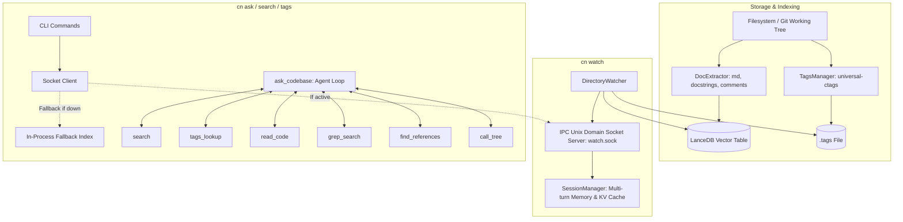
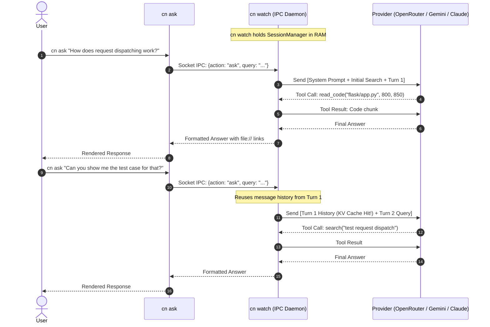

# Technical Design: codebase-navigator

## 1. Executive Summary & Vision

As described in [`README.md`](file:///home/nigel/code/codebase-navigator/README.md), modern AI coding assistants and developers face a fundamental dilemma:
1. **Context Bloat & Token Waste**: Ingesting entire codebases or hundreds of source files into LLM context windows burns millions of tokens, incurs massive latency, and often degrades reasoning fidelity ("lost in the middle").
2. **Brittle Brute-Force Grepping**: Forcing an LLM to blindly guess regex patterns via `ripgrep` wastes 3–6 agent turns just trying to locate basic definitions or call sites.
3. **High Startup Friction**: Traditional code intelligence tools require heavy external services (e.g. Docker, dedicated vector databases, or Ollama daemons).

`codebase-navigator` (`cn`) solves this by providing an **ultra-lightweight, self-contained code intelligence engine and agent harness**. It combines:
- **Instant Vector Retrieval** via LanceDB and embedded `sentence-transformers` without external service daemons.
- **Deterministic Symbol Navigation** via Git-aware `universal-ctags`.
- **Live Incremental Indexing & Daemon Socket** via `cn watch`.
- **Multi-turn Session Memory & Provider KV-Cache Continuity** across CLI invocations.
- **Autonomous Agent Harness (`cn ask`)** equipped with 1-shot hybrid code intelligence tools (`search`, `tags_lookup`, `read_code`, `grep_search`, `find_references`), fronted by a deterministic question router that skips semantic retrieval for plain symbol lookups.

```
                              ┌────────────────────────────────────────────────────────┐
                              │                    codebase-navigator                  │
                              │                                                        │
                              │   ┌─────────────┐   ┌──────────────┐   ┌───────────┐   │
                              │   │ LanceDB RAG │ + │ ctags (.tags)│ + │ AST/Tools │   │
                              │   └─────────────┘   └──────────────┘   └───────────┘   │
                              └───────────────────────────┬────────────────────────────┘
                                                          │
                                         ┌────────────────┴────────────────┐
                                         ▼                                 ▼
                             ┌───────────────────────┐         ┌───────────────────────┐
                             │ Human Dev Orientation │         │ Autonomous AI Agents  │
                             │ (Fast CLI Q&A & Tags) │         │ (40-80% Token Savings)│
                             └───────────────────────┘         └───────────────────────┘
```

---

## 2. System Architecture

The project is structured into modular layers spanning indexing, background daemon services, tool execution, and the LLM agent harness:



---

## 3. Core Subsystems

### 3.1. Vector & Semantic Search (`index.py`, `extractor.py`)
- **Model**: `sentence-transformers/all-MiniLM-L6-v2` runs locally in-process via PyTorch/Transformers.
- **Storage**: Serverless LanceDB vector database persisted under `.codebase-navigator/`.
- **Encoder window**: fastembed's build of this model truncates at **128 tokens**,
  not the 256/512 the model card implies. 73% of indexed chunks exceed that and
  61% of indexed content never reaches the encoder. Counter-intuitively this is
  fine: splitting chunks to fit measured *worse* retrieval (MRR 0.717 -> 0.561),
  because a code chunk's head -- signature plus docstring -- carries the
  identifying signal while body fragments are low-signal near-duplicates that
  crowd distinct files out of the top-k. `split_oversize_chunks()` exists and is
  tested behind `CN_SPLIT_OVERSIZE_CHUNKS`; turn it on only when moving to a
  long-context code embedding model, where truncation no longer hides the tail.
- **Ranking** (`VectorIndex.search`):
  - **Reciprocal Rank Fusion** over the vector and BM25/FTS result lists (k=20,
    FTS weighted 1.2). RRF is rank-based and scale-free, so it is used directly
    rather than compared against raw cosine proximity -- an earlier
    `max(cosine, rrf)` formulation meant the vector term always won and the BM25
    half of the "hybrid" search was silently discarded.
  - Identifier-aware boosts proportional to the share of query terms matched in
    the chunk title, path, and body. Scores are deliberately unclamped: an
    earlier `min(0.99, ...)` ceiling tied distinct candidates together and made
    the score useless as a confidence signal.
  - **Code-first ordering**: documentation is demoted below code, but never
    dropped, and the demotion is skipped for doc-seeking queries
    (`is_doc_seeking`). Doc-heavy repositories otherwise drown code -- FastAPI
    indexes 15,839 markdown chunks against 5,689 code chunks, and 8.6 of every
    10 unfiltered hits were prose.
  - **Per-file diversity cap** (`MAX_CHUNKS_PER_FILE`): several chunks of one
    file crowded out other candidates, giving only 4.8 distinct files per 10
    hits; capping raises that to 9.7.
  - Granular chunking: Markdown section headers, term definitions, Python class/function docstrings, and generic multi-line comment blocks.
- **Concurrent Search Safety**: In-process indexes share one lazily initialized
  FastEmbed/ONNX model. Query embedding is serialized to avoid competing ONNX
  session initialization and inference stalls, while LanceDB reads remain
  parallel.

### 3.2. Git-Aware Symbol Indexing (`tags.py`)
- Uses `universal-ctags` with `-L - --fields=+n+K --sort=yes`.
- Restricts indexing to files recognized by `git ls-files` (or source extensions) to exclude `node_modules`, build artifacts, and vendor dumps.

### 3.3. Live Watcher & Daemon Session IPC (`watcher.py`, `ipc.py`)
- **`watchfiles` Engine**: Detects code and documentation modifications with a 1000ms debounce.
- **Dual Transport IPC**:
  - **Unix Domain Socket**: Listens on `.codebase-navigator/watch.sock` for high-speed local IPC.
  - **Loopback TCP Transport**: Binds on `127.0.0.1:<port>` with port metadata written to `.codebase-navigator/watch.port`. The default port is deterministically hashed from the directory path into the range `10000..59999` with automatic collision fallback. This allows sandboxed runtimes (like Codex sandboxes or Docker containers with volume socket restrictions) to seamlessly connect.
- **Hot In-Memory State**: Keeps the LanceDB table and embedding model pre-loaded in memory, delivering sub-10ms semantic searches to CLI clients.
- **Persistent Conversation Session**:
  - `cn watch` maintains the agent conversation message history across repeated `cn ask` commands.
  - Subsequent queries append to the existing conversation tree, enabling provider-side **KV prompt caching** and zero-overhead follow-up questions.

### 3.4. Agent Intelligence Tools (`tools.py`)
To prevent the LLM from spending dozens of turns and thousands of tokens doing brute-force file navigation:

| Tool | Implementation | Purpose & Token Optimization |
|---|---|---|
| `search` | LanceDB hybrid query (RRF over vector + BM25) | Semantic retrieval of relevant concepts, docstrings, and modules. |
| `tags_lookup` | Regex match on `.tags` | 1-step direct resolution of symbol definitions without fuzzy guessing. |
| `read_code` | Line-bounded file reader | Safe viewing of function/file bodies with clickable file URI links. Accepts a `ranges` array so several spans (or several files) are fetched in one turn. |
| `grep_search` | Subprocess `rg --json` with pure Python fallback | Fast pattern and literal matching across codebase. Emits loud warning when `rg` is missing. |
| `find_references` | Hybrid ctags + ripgrep | 1-shot tool returning symbol definition + all caller and usage sites across the repo. |

`call_tree` remains implemented in `tools.py` but is no longer advertised in the
default tool spec: it was called zero times across 25 benchmark tasks while
costing spec tokens on every turn, and `find_references` covers the same need.

Every grep-style result is byte-capped per match (`MAX_MATCH_CHARS`). A single
generated line in a real repository can be ~486k characters; uncapped, one such
match cost ~179k tokens in a single tool result and was then re-sent on every
subsequent turn.

### 3.5. Agent Harness & Execution Loop (`ask.py`)
- **Question Routing**: `classify_question()` decides, deterministically and
  without an LLM call, whether a question warrants pre-flight retrieval.
  Identifier lookups ("where is `FlaskGroup` defined?") go straight to
  `grep_search`/`tags_lookup`; conceptual questions ("how does the dispatch flow
  work?") get the seed. The seed costs ~1,700 tokens and, because it lives in
  the message history, is re-sent on every subsequent turn -- roughly 13.6k
  cumulative over a typical 8-turn session -- while only ~2.8 of its 10 chunks
  came from a file the agent went on to open. A misroute is cheap: the agent
  still has `search` and recovers in one tool call. Override with
  `seed_mode`/`CN_SEED_MODE` (`always` | `router` | `never`).
- **Pre-flight Seed Retrieval**: For conceptual questions, conducts a top-10
  hybrid semantic search and attaches the results to the first user turn.
- **System Prompt Guardrails**:
  - Rejects off-topic conversational queries; strictly answers repository implementation details.
  - Requires verification of code definitions via `read_code` or `view_symbol` before asserting implementation details.
  - Explicit instruction to conserve tokens and avoid redundant tool calls.
- **Configurable Tool Budget**: Defaults to generous turn limits, with automatic fallback when the model produces the final synthesis.

---

## 4. Multi-Turn Session & KV Cache Flow

When `cn watch` is active, the conversational flow between successive `cn ask` invocations is preserved:



---

## 5. Evaluation & Benchmarking Strategy

To ensure high-quality, hallucination-free retrieval across multiple languages, evaluation test suites are run against standard open-source repositories in `eval/repos/`:

1. **`tiangolo/fastapi`** (Python): Dependency injection resolution and route parameter parsing.
2. **`pallets/flask`** (Python): Request lifecycle, `before_request` hooks, and WSGI dispatch.
3. **`encode/httpx`** (Python): Sync vs async transport routing and connection pooling.
4. **`astral-sh/uv`** (Rust): CLI dependency resolution entry points and workspace crate graphs.
5. **`go-vikunja/vikunja`** (Go + Frontend): Background queue workers, reminder scheduling, and API routing.
6. **`expressjs/express`** (Node.js/JS): Middleware stack compilation and router layer matching.

The suite mixes two question shapes, because they exercise opposite paths:
25 **conceptual** questions ("how does X work") that justify semantic retrieval,
and 7 **lookup** questions ("where is `FlaskGroup` defined?") that a single
ripgrep answers and where pre-flight retrieval is pure overhead. Without the
lookup half the question router cannot be measured at all -- every conceptual
question routes the same way with or without it.

### Metric Criteria:
- **Retrieval Precision**: Does the agent cite the exact file and line numbers of the true implementation?
- **Turn Efficiency**: Does the agent reach the correct conclusion within 1–3 tool turns?
- **Token Economy**: Does the hybrid toolset reduce total prompt/completion tokens compared to raw file grep sweeps?

### Fairness constraints

A/B token comparisons are only meaningful when both arms are bounded the same
way. Both `cn` and the baseline harness byte-cap individual grep matches; before
that cap existed the baseline capped by line count only, so one 486k-character
generated line in vikunja produced a ~179k-token tool result. That single task
supplied *all* of a reported "+15.8% token saving" -- with it excluded the same
run showed cn 17.5% **worse** than the baseline. Prefer the median per-task
outcome and the win/loss split over a summed aggregate, which one pathological
task can dominate.

Note also that a 25/25-vs-25/25 pass rate means the suite has no accuracy
headroom left and is measuring cost only.

Repositories are cloned only when missing; existing checkouts are never updated
by the evaluator. LanceDB and ctags indexes are built atomically and cached at
`eval/repos/_indexes/<repository>/<codebase-navigator-short-hash>/`. A sidecar
manifest pins the full codebase-navigator and target-repository commits,
embedding model, indexed counts, and a SHA-256 over the complete immutable index
tree. Cache hits recompute and validate that hash before reuse.

Each benchmark invocation produces an auditable package under
`eval/runs/run_<UTC timestamp>/` containing `report.json`, `log.jsonl`, the exact
benchmark task snapshot, and per-repository index metadata snapshots. Both the
initial index hash and post-run verification hash are logged. Repository Git
commits, embedding model, candidate model, judge model, and cumulative per-call
token usage are recorded. Parallel TTY progress reserves one independently
updated line per worker, leading with elapsed time and then the current
local-search phase. Rows are capped at 80 terminal columns to prevent wrapping,
while each completed task's question and result lines are buffered and inserted
atomically above the live region. Phase changes are appended immediately to
`log.jsonl` so incomplete tasks remain diagnosable;
interruption cancels queued futures, records partial-run status, and the
CLI terminates without waiting on blocked network threads. The judge defaults
to `deepseek/deepseek-v4-pro` and is independently configurable from the
candidate model.

---

## 6. Search Efficiency: Strategies and Tactics

`codebase-navigator` strives to reduce **tokens spent per answered question**
without losing accuracy. It is the central goal of this tool. Every measure below
is the concrete means for how the goal is achieved. We took a scientific
approach, using evaluations in `eval/` to measure against what realistic coding
harnesses will do without code embeddings, and devise strategies and tactics to
improve the tool. We don't just document what works: where a tactic was tried
and rejected, the rejection is recorded too, so it is not silently reinvented.

### 6.0. What we measure, and what it told us

#### The instruments

Every claim in this section comes from one of three measurements. Nothing here
is reasoned from first principles; where we only have an argument and not a
number, the text says so.

**1. The A/B benchmark** (`eval/runner.py --compare-baseline`). Runs the same
question twice over the same pinned repository checkout: once through `cn ask`,
once through a plain agent given `read_file`, `grep`, `find_files`, `list_dir`
and `bash`. Both arms use the same model and the same bounds. Per task we record:

| field | meaning |
|---|---|
| `tokens` | prompt + completion, summed across every model call in the task |
| `net_tokens` | uncached prompt + completion — what you pay for after KV caching |
| `cached_tokens` | prompt tokens the provider served from cache |
| `api_calls` | round trips to the model. This is the turn count |
| `duration_seconds` | wall clock |
| `passed` | an LLM judge verdict against a written expected-answer key, with keyword/file rules as the fallback when `--no-judge` is set |

**2. Offline retrieval scoring.** Ranking changes are scored without spending a
token: for each benchmark question we know which file holds the answer
(`required_files`), so we can measure **recall@1/3/5/10** (is the right file in
the top k), **MRR**, and **distinct files per 10 hits**. This is what makes it
practical to try a dozen ranking variants in a minute rather than a night.

**3. Direct instrumentation of the index and the prompt.** Chunk token lengths
against the encoder's real window, seed size in tokens, per-turn fixed overhead
(system prompt + tool spec), tool-call traces per task.

#### How we read the results

Three rules, each learned by getting it wrong first:

- **Report the median per task alongside the aggregate.** They routinely
  disagree, and the disagreement is the finding. One run: aggregate **+14.7%**
  against a median of **−8.8%** — cn wins large on hard questions and loses
  slightly on easy ones. Either number alone misleads.
- **Always check the outlier-removed figure.** A reported "+15.8% token saving"
  became **−17.5%** when one task was excluded. Its baseline arm had matched a
  single 486,303-character generated line against a harness that capped output by
  line count but not by bytes. One task produced the entire headline.
- **Compare only what is comparably bounded, and score infrastructure faults
  separately.** Both arms must cap tool output the same way, or the number
  measures the harness rather than the tool. A dropped socket is not a wrong
  answer; counting it as one silently understates the score.

#### What the measurements told us

Two findings drive every decision that follows:

1. **Token cost scales with turn count, not with how much you read.** Every tool
   call re-sends the entire conversation so far, so cost grows superlinearly in
   turns. Measured correlation between a task's `api_calls` and its `tokens`:
   **r = 0.887** on one run and **0.874** on a later one, so it holds as the tool
   changes. One avoided round trip is worth far more than one trimmed tool
   result — which is why several tactics below spend tokens to save a turn.
2. **Anything placed in the first user turn is paid for on every later turn.**
   The pre-flight seed is not a one-off ~1,600-token cost; across eight turns it
   is a ~13,000-token cost.

And one consequence that constrains the fixes: **context already in the history
is nearly free to keep and expensive to change.** The measured KV cache hit rate
is **65.2%** of prompt tokens, so editing or evicting an earlier message
invalidates the prefix from that point on and costs more than it saves. Anything
expensive has to be made small *before* it enters the history, never trimmed
afterwards.

### 6.1. Stage 1 — Routing the query (before any model call)

`route_question()` decides whether the question deserves pre-flight semantic
retrieval at all. It is a **deterministic heuristic, not a learned model, and not
an LLM call**: asking a model to route would cost a full round trip, which is
precisely the cost routing exists to avoid.

- **Identifier lookups** ("where is create_venv") route to `lookup`: no seed is
  built, and the agent goes straight to `tags_lookup`/`grep_search`.
- **Mechanism questions** ("how does dispatch work") route to `conceptual` and
  receive the seed.
- A misroute is cheap **in both directions** — the agent still has `search` and
  recovers in one tool call — and that asymmetry-free failure mode is what
  justifies a heuristic over anything heavier.
- Override with `seed_mode` / `CN_SEED_MODE`: `router` (default), `always`
  (pre-router behaviour), `never` (the agent decides implicitly by choosing its
  first tool).

Measured: ~2.8 of every 10 seeded chunks came from a file the agent actually
opened, so on lookup-shaped questions the seed was close to pure cost.

Validated by `eval/router_eval.py` against an LLM-generated, independently
LLM-labelled query set, because the benchmark questions were written by the same
author as the rules — scoring a heuristic on its author's own examples measures
nothing.

### 6.2. Stage 2 — Retrieval

Runs only for `conceptual` questions. `VectorIndex.search()` is a hybrid
retriever with several corrections layered on top:

| Tactic | Mechanism | Why |
|---|---|---|
| **Hybrid candidates** | Vector (cosine) and BM25/FTS queried separately, `fetch_limit = max(limit*6, 40)` | Semantic recall plus exact-identifier recall; the pool must exceed `limit` because later stages discard candidates |
| **Reciprocal Rank Fusion** | k=20, FTS weighted 1.2, used **directly** as the score | RRF is rank-based and scale-free. An earlier `max(cosine, rrf)` formulation meant cosine (0.7–0.95 for almost any pair) always beat RRF (≤0.90), silently discarding the BM25 half of the "hybrid" search |
| **Identifier boosts** | +0.25 × share of query terms in title, +0.20 in path, +0.10 in body, +0.15 exact phrase in title | Proportional to *share matched*, so 3/3 terms outranks 1/3 |
| **No score ceiling** | The old `min(0.99, …)` clamp is gone | The clamp tied distinct candidates together; 7 of 25 questions previously showed all top-5 chunks at "Relevance: 99%", making the score useless as a signal |
| **Per-file diversity** | `MAX_CHUNKS_PER_FILE = 1` | Several chunks of one file crowded out other candidates: 4.8 → **9.7** distinct files per 10 hits |
| **Code-first ordering** | Documentation demoted below code, never dropped; skipped when `is_doc_seeking(query)` | FastAPI indexes 15,839 markdown chunks against 5,689 code ones, so 8.6 of every 10 unfiltered hits were prose. The doc-seeking exemption keeps glossary/README questions working |

Cumulative effect on the 25 conceptual benchmark questions:

| configuration | recall@1 | recall@3 | recall@10 | MRR |
|---|---|---|---|---|
| before | 10/25 | 15/25 | 20/25 | 0.505 |
| + code-first | 17/25 | 19/25 | 22/25 | 0.736 |
| + real RRF | 18/25 | 20/25 | 21/25 | 0.757 |
| + diversity cap | 18/25 | 20/25 | **23/25** | **0.784** |

### 6.3. Stage 3 — The embedding window

The encoder's input limit is a hard ceiling on what the index can represent, and
it is **not** what model metadata claims. fastembed reports `max_length: None`
for every model; `all-MiniLM-L6-v2` advertises 256/512 and truncates at **128**.
Under it, 73.3% of chunks overflowed and **61.3% of all indexed content never
reached the encoder** — present in the index as text, represented by no vector.

The default is now `jinaai/jina-embeddings-v2-base-code`: an **8192-token
window** (64×) and trained on code. Costs: 768 dimensions instead of 384, and
bulk indexing at 11 chunks/sec instead of 78. Interactive query embedding is
18 ms → 31 ms, imperceptible, and the watcher updates incrementally, so the slow
path is one-time.

Always verify a candidate model by reading its tokenizer's `truncation` config,
never its advertised context length. Note also that a tokenizer cloned for
*measuring* length must have both truncation **and padding** disabled — with
padding on, `encode()` returns exactly `max_length` for every input and any
length check silently passes.

**Rejected: splitting chunks to fit the window.** It recovers 100% of the
content and measured *worse* — MRR 0.717 → 0.561, and 0.608 even with the
diversity cap, with distinct files per 10 hits falling 4.3 → 3.5. A code chunk's
head (signature + docstring) carries the identifying signal; body fragments are
low-signal near-duplicates that crowd out distinct files. The line cap was
accidentally right for a short-context encoder. `split_oversize_chunks()` is
retained and tested behind `CN_SPLIT_OVERSIZE_CHUNKS`, because it becomes correct
once the window is large enough that truncation is no longer hiding the tail.

Changing the model changes the vector width; `VectorIndex` raises
`IndexModelMismatch` naming both dimensions rather than letting LanceDB surface
an opaque "no vector column" error at query time.

### 6.4. Stage 4 — Building the first turn

The first user message carries the question plus, at most:

1. **A compact repository tree** (depth 2, ≤50 entries, ~170 tokens) — buys
   spatial awareness that would otherwise cost 2–4 `ls`/`find` turns.
2. **Exact symbol definitions** from `.tags`, when the question names something.
3. **The pre-flight seed**, tiered: `SEED_FULL_CHUNKS = 2` chunks rendered in
   full with bodies capped at `SEED_CHUNK_BODY_LINES = 16`, the rest collapsed to
   one-line candidates (path, title, relevance, first line).

Seed sizing is a direct trade against the per-turn multiplier: 3 full chunks
averaged 1,586 tokens, 2 full with capped bodies averages 976 (**−38%**), and
recall@3 of 20/25 means the third full chunk is rarely the deciding one.

**Symbol candidates are allowlisted by shape, not denied by wordlist.**
`_is_identifier_shaped()` accepts snake_case, CamelCase, dotted names, tokens
containing digits, and backtick-quoted spans. An English stopword denylist was
tried first and never converged — it was missing *contains*, *defined*, *find*,
*definition*, and each miss was expensive because large repositories genuinely
define symbols named `Contains` (uv) and `defined` (a minified file in vikunja).
Identifier-shaped candidates get the lookup budget first; bare words may fill
leftover budget but only on an exact tag hit, so `flaskgroup` still resolves
while `contains` cannot manufacture matches.

The confidence gate is **relative, not absolute**: chunks from the gold file
score a median 0.72 against 0.69 for the rest, so no absolute threshold separates
them. The seed is dropped entirely when the top score is below 0.45, and
otherwise keeps chunks scoring at least 55% of the top hit.

Relevance is displayed **relative to the top hit**, since RRF scores are
unbounded and an absolute percentage would exceed 100%.

### 6.5. Stage 5 — The agent loop

| Tactic | Mechanism | Why |
|---|---|---|
| **Batched reads** | `read_code` accepts a `ranges` array covering several spans, in one or many files | 150 read calls in one run hit only 75 distinct files — half were re-reads of an already-open file, each costing a full round trip |
| **Lean per-turn payload** | System prompt 244 tokens, tool spec 779 | Fixed overhead is paid on *every* turn; at one point it was 2.6× the entire cn/baseline token gap. `call_tree` was dropped from the spec after 0 uses across 25 tasks |
| **Byte-capped tool output** | `MAX_MATCH_CHARS = 240` per grep match | One generated line in vikunja is 486,303 characters; uncapped, a single match produced a ~179k-token tool result that was then re-sent every turn |
| **Duplicate-call suppression** | Identical `(tool, args)` pairs return a short notice instead of re-executing | Prevents loops from paying twice |
| **Budget awareness** | The agent is told its remaining turns at `BUDGET_WARNING_TURNS = 3`, with a hard synthesis cliff at zero | Measured turn use is p50 5 / p90 11 / max 14 against a budget of 15 — the cliff effectively never fired, so the long tail was the agent's own choice, and every remaining loss to the baseline is a task where cn ran longer |
| **Retry, don't fail** | 408/409/429/5xx and transport errors retried with exponential backoff; auth failures never retried | A dropped socket previously destroyed an entire session, and in the harness was scored as a wrong answer |

### 6.6. Stage 6 — Across invocations

`cn watch` holds the `AgentSession` in memory behind a Unix socket, so successive
`cn ask` calls reuse the message history and hit the provider's KV cache rather
than rebuilding context. Indexes are content-addressed by codebase-navigator
commit and repository commit, so an unchanged tree is never re-embedded.

### 6.7. What the numbers mean

Report both the **aggregate** and the **median** per-task saving, because they
routinely disagree — and the disagreement is the finding. A representative run:
aggregate **+14.7%** against a median of **−8.8%**, meaning cn wins large on hard
questions and loses slightly on easy ones. Reporting either alone is misleading.

Two further cautions, learned the hard way:

- **A summed aggregate can be produced entirely by one task.** A reported
  "+15.8% token saving" collapsed to **−17.5%** when a single task was excluded,
  because that task's baseline arm matched one 486k-character line against a
  harness that capped by line count but not by bytes. Both arms must be bounded
  identically before any token comparison means anything; check the
  outlier-removed figure every time.
- **Infrastructure faults are not wrong answers.** The harness scores them
  separately; conflating them silently understates the score and makes runs
  incomparable.
